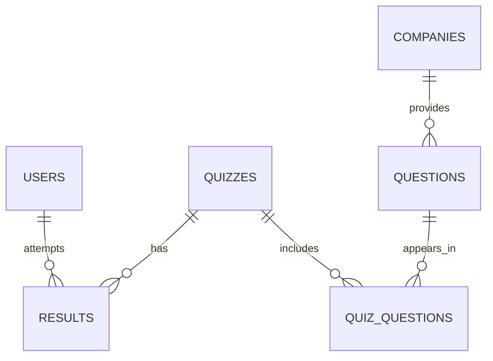

# Placement Portal — Project Report

## Team, Roles, and Responsibilities

- Frontend Developers: Kunj, Jaiprakash, Tanishq
  - Design and implement UI screens (Login, Registration, Dashboard, Quizzes, Profile)
  - Ensure responsive design for desktop and mobile
  - Handle form validation (email, password strength, quiz inputs)
  - Integrate frontend with backend APIs

- Backend Developers: Sujal, Tanishq
  - Develop REST APIs for login, registration, quiz handling, company‑wise questions, and results
  - Implement authentication and authorization
  - Manage business logic (quiz scoring, coding challenge evaluation)
  - Ensure secure data flow between frontend and database

- Database Designers: Tanishq, Kunj
  - Design and maintain the database schema
  - Define relationships between students, companies, quizzes, and coding questions
  - Optimize queries for performance; ensure proper indexing and normalization

- Tester / QA Specialists: Jaiprakash, Sujal
  - Write test cases for each module (unit, integration, system testing)
  - Perform usability testing of UI
  - Test database queries, backend logic, and API responses
  - Report bugs and ensure fixes before deployment

- Documentation Specialists: Jaiprakash, Sujal, Kunj
  - Maintain project documentation (SRS, design docs, user manuals)
  - Create diagrams; prepare final report and presentation
  - Track version history and update records

---

## Frontend Design Layout & Tools

### User Screens

- Login Page
  - Fields: Email, Password
  - Actions: Login, Forgot Password, Register
  - Navigation: On success → Dashboard; link to Registration

- Registration Page
  - Fields: Name, Email, Password, Confirm Password, Branch, Year
  - Actions: Register, Back to Login

- Dashboard
  - Sections: Coding Questions, Company‑wise Questions, Quizzes, Reports, Profile

- Coding Questions Page
  - UI: Search bar, difficulty filter, list of questions, “Solve” button

- Coding Editor Page
  - UI: Code editor, language selector (C, C++, Java, Python), Run / Submit buttons, output panel

- Company‑wise Questions Page
  - UI: Company dropdown (TCS, Infosys, Wipro), past interview questions list

- Quiz Page
  - UI: Timer, question + options, Next / Previous, Submit, scorecard on completion

- Profile Page
  - Fields: Name, Email, Branch, Year, Attempted Quizzes, Scores
  - Actions: Edit Profile, Logout

### Frontend Tools / Technologies

- HTML, CSS, JavaScript, React.js
- Styling: Bootstrap or Tailwind CSS
- Design: Figma

---

## Backend Design Layout & Tools

### System Architecture

Frontend (React) → REST API → Backend (Node.js/Express) → Database (MySQL / PostgreSQL / Firestore)

```mermaid
flowchart LR
  U[User] --> R[React Frontend]
  R -->|HTTP/JSON (REST)| A[Express API]
  A -->|Auth (JWT/Firebase)| AUTH[(Auth Provider)]
  A -->|CRUD| DB[(MySQL / PostgreSQL / Firestore)]
  A -->|Optional: Code Exec| J[Sandbox / Online Judge]
```

### Logic Flow

- Login: User enters credentials → Backend verifies against DB → success/failure → returns token/session
- Registration: Store user details in DB; send confirmation
- Coding Questions: Backend fetches questions from DB; returns JSON
- Code Execution: Backend compiles/runs code in sandbox or via online judge; returns output
- Quiz: Answers stored temporarily; score computed on submission; result saved in DB
- Reports: Backend aggregates performance data; returns to frontend for charts/tables

### Backend Tools / Technologies

- Node.js with Express.js
- Authentication: JWT or Firebase
- APIs: REST (documented/tested with Postman)

---

## Database Design & Table Descriptions

- Database Options: MySQL or Firestore

### Schema & Tables

- Users
  - user_id (PK), name, email (unique), password, branch, year

- Companies
  - company_id (PK), company_name, sector

- Questions
  - question_id (PK), title, description, difficulty, type, company_id (FK → Companies)

- Quizzes
  - quiz_id (PK), title, total_questions, duration

- Results
  - result_id (PK), user_id (FK → Users), quiz_id (FK → Quizzes), score, date_attempted

### Relationships

- A User can attempt multiple Quizzes (Users 1—* Results, Quizzes 1—* Results)
- A Company can have multiple Questions (Companies 1—* Questions)
- A Question can belong to multiple Quizzes (many‑to‑many via a join table, e.g., quiz_questions)



> Note: For relational DBs, add indexes on email (Users), company_id (Questions), and FKs in Results/Quiz_Questions. Normalize text fields; consider JSON columns for flexible question metadata if needed.

---

## Integration Explanation

### Example Flow: Quiz Attempt

1. Frontend (User Action): Student logs in, selects a quiz, answers questions, and submits
2. Backend (Processing): API validates answers, calculates score, updates Results table
3. Database (Storage): Stores user responses, score, and timestamp
4. Backend → Frontend (Response): Returns result summary
5. Frontend (Output): Displays score, performance graph; data shown in Profile/Reports

---

## Notes

- This report captures the agreed scope and responsibilities to guide implementation and testing.
- Detailed API specs, payload schemas, and UI wireframes can be added as separate documents under docs/ as they are finalized.
